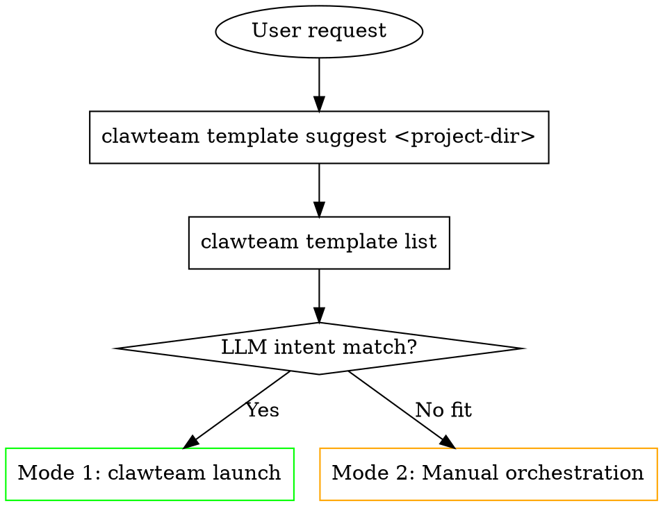

# ClawTeam Multi-Agent Coordination

ClawTeam is a CLI tool for coordinating multiple AI agents as a team. Operations
via `clawteam` CLI, data in `~/.clawteam/`.

## Template-First Decision

**ALWAYS check for a matching template BEFORE manual orchestration.**



### Step 1: Select Template (three-step, each fallback to next)

1. **Project-based suggestion** (if project dir available):
   `clawteam template suggest <project-directory>` — scans for DTK/Qt/deepin signals
2. **LLM intent matching** — review available templates, match by *meaning*:
   `clawteam template list`

   | Template | Intent | Examples |
   |----------|--------|---------|
   | `bug-fix` | Fix bugs / defects / crashes | "修复这个bug", "fix crash", "PMS BUG 149203" |
   | `code-review` | Review code quality | "代码审查", "review this PR" |
   | `research-paper` | Write academic papers | "写论文", "research paper on..." |
   | `hedge-fund` | Investment/financial analysis | "量化投资", "portfolio optimization" |
   | `strategy-room` | Strategic decision making | "制定策略", "strategy meeting" |
   | `dde-trellis` | DDE/DTK projects (Qt) | Detected via `template suggest` |
   | `software-dev` | General software development | "Build a web app", "add feature X" |
   | `post-completion` | Post-task review & cleanup | After completing tasks |

3. **No template fits → Mode 2 (Manual)**

### Step 2: Mode 1 — Launch (PREFERRED)

```bash
clawteam launch <template> -g "<user's goal>" --team-name <team-name>
# Options: --backend wsh | --workspace
```

`clawteam launch` creates team, tasks (with deps), and spawns **only the leader**.
Workers are spawned **on-demand by the leader** via `clawteam spawn --team ... --agent-name ...` (auto-injected in leader's prompt).
Your ONLY job after launch is SUPERVISION:

```bash
clawteam board show <team>           # Monitor progress
tmux attach -t clawteam-<team>      # Watch agents work
clawteam inbox receive <team> --agent <leader>  # Check messages
```

**NEVER duplicate launch steps** — do NOT manually create team/tasks/spawn after `clawteam launch`.

### Step 3: Mode 2 — Manual (FALLBACK ONLY)

#### Phase 0: Gather Context

1. Read design docs: `.sdd/changes/`, `.trellis/`, `AGENTS.md`, `docs/`, `plans/`
2. Understand goal and constraints
3. Break into independent, parallelizable subtasks with clear acceptance criteria

#### Phase 1-3: Team Setup → Tasks → Workers

```bash
# Set leader identity (REQUIRED)
export CLAWTEAM_AGENT_ID="leader-001"
export CLAWTEAM_AGENT_NAME="leader"
export CLAWTEAM_AGENT_TYPE="leader"

# Create team
clawteam team spawn-team <team> -d "<description>" -n leader

# Create ALL tasks before spawning (use --blocked-by for deps)
T1=$(clawteam --json task create <team> "<subject>" -o worker1 -d "<desc>" | python3 -c "import sys,json;print(json.load(sys.stdin)['id'])")
T3=$(clawteam --json task create <team> "<subject>" -o worker3 --blocked-by "$T1,$T2" | ...)

# Verify tasks before spawning
clawteam task list <team>

# Spawn workers (each gets git worktree + tmux/wsh session)
clawteam spawn --team <team> --agent-name worker1 --task "<task>"
clawteam spawn --team <team> --agent-name worker2 --task "<task>"
```

#### Phase 4: Supervision Loop

```
LOOP:
  1. clawteam board show <team>        # Check progress
  2. clawteam inbox receive <team> --agent leader  # Check messages
  3. Process messages (reports, questions, completions)
  4. Detect stalled workers (see references/workflows.md)
  5. Assign unlocked tasks
  6. If all done → Phase 5
```

#### Phase 5: Review & Integration

```bash
# Review worker output
clawteam workspace list <team>
clawteam context diff <team> <worker>

# Merge and test
clawteam workspace merge <team> <worker>   # repeat per worker

# If issues → send correction
clawteam inbox send <team> <worker> "Issue found: <desc>. Fix and re-commit."

# Final commit + cleanup
git add -A && git commit -m "<message>"
clawteam team cleanup <team> --force
```

## Quick Reference

| Action | Command |
|--------|---------|
| Create team | `clawteam team spawn-team <team> -d "<desc>"` |
| Create task | `clawteam task create <team> "<subject>" -o <owner> --blocked-by <ids>` |
| Spawn worker | `clawteam spawn --team <team> --agent-name <name> --task "<task>"` |
| Leader spawn/stop | `clawteam spawn --team <team> --agent-name <name>` / `clawteam lifecycle request-shutdown <team> leader <name> --force` |
| List tasks | `clawteam task list <team> [--status blocked] [--owner <name>]` |
| Update task | `clawteam task update <team> <id> --status completed` |
| Send message | `clawteam inbox send <team> <to> "<msg>"` |
| Receive inbox | `clawteam inbox receive <team>` (consumes) / `peek` (non-destructive) |
| Board view | `clawteam board show <team>` / `live` / `attach` |
| Review changes | `clawteam workspace list <team>` / `clawteam context diff <team> <worker>` |
| Merge worktree | `clawteam workspace merge <team> <worker>` |
| Wait all done | `clawteam task wait <team> --timeout 300` |
| Non-default provider | `clawteam profile wizard` then `clawteam spawn --profile <name> ...` |

## Role Boundaries (DO NOT Violate)

| Role | MUST NOT Do | Reason |
|------|-------------|--------|
| **Leader** | `clawteam spawn --agent-name leader` | Current session IS the leader |
| **Leader** | `clawteam task list --owner me` | Leaders don't execute tasks |
| **Leader** | Manually create team/tasks/spawn after `clawteam launch` | `launch` already did all of this |
| **Worker** | `clawteam team spawn-team` / `clawteam launch` | Workers don't create teams |
| **Worker** | `clawteam task create` | Workers don't design tasks |
| **Worker** | Exit after first task | Workers MUST keep polling for more work |
| **Worker** | Skip inbox polling | Inbox carries corrections, task reassignment, and shutdown signals — missing these stalls the team |

## Key Gotchas

- `inbox receive` **consumes** messages — use `peek` for non-destructive reads
- Completing a task **auto-unblocks** dependent tasks
- Workers MUST keep polling tasks/inbox — do NOT exit after first task
- Leader MUST keep polling inbox/board in the supervision loop
- **`clawteam launch` creates team + tasks + spawns only the leader** — workers are spawned on-demand by the leader via `clawteam spawn --team ... --agent-name ...`
- **Leader stops workers** with `clawteam lifecycle request-shutdown <team> leader <name> --force`
- **NEVER spawn a leader** via `clawteam spawn` in Mode 2 — current session IS the leader
- For `dde-trellis` template: 7-stage workflow with quality gates, requires `/trellis/onboard` first
- All commands support `--json` (place before subcommand): `clawteam --json task list <team>`

## Team Name Consistency

**ALWAYS use the SAME team name throughout.** Inconsistency causes orphaned sessions.

```bash
TEAM="my-feature-branch"  # ONE SOURCE OF TRUTH
clawteam team spawn-team $TEAM
clawteam task create $TEAM "..."
clawteam spawn --team $TEAM --agent-name ...
clawteam task wait $TEAM
clawteam team cleanup $TEAM
```

## Additional Resources

- **`references/data-model.md`** — Task statuses, message types, file storage layout, env vars
- **`references/workflows.md`** — Stalled worker detection/recovery, leader/worker loop protocols, shutdown, backend-specific commands (tmux/wsh/subprocess)

## Quality Verification

After a worker completes a task, the leader verifies the build and runtime via
`clawteam-verifier` agent. Verification internals and parameters are documented
in the `clawteam-verifier` skill — leader only needs the following.

### When to Verify

- After worker marks a task completed (before merge/PR)
- Before `clawteam workspace merge`

### Leader Actions

**1. Detect project type, determine build/run commands:**

| Type | Detection | `build_command` | `run_command` |
|------|-----------|-----------------|---------------|
| DDE/Qt | `CMakeLists.txt` | `cmake --build build --parallel` | `./build/bin/<app>` |
| Python | `pyproject.toml`, `setup.py` | `pip install -e .` | `python -m <pkg>` |
| Node.js | `package.json` | `npm run build` | `npm test` |
| Rust | `Cargo.toml` | `cargo build` | `cargo run` |

**2. Send verification task (JSON schema in verifier skill):**

```bash
clawteam inbox send <team> clawteam-verifier '{
  "target_agent": "worker1",
  "work_dir": "/home/user/.clawteam/workspaces/<team>/worker1",
  "build_command": "cmake --build build --parallel",
  "run_command": "./build/bin/myapp",
  "thresholds": {
    "max_memory_mb": 1024,
    "max_cpu_percent": 80,
    "max_time_seconds": 15
  }
}'
```

**3. Handle results:**

| Result | Leader Action |
|--------|---------------|
| ✅ Pass | Mark completed, merge worktree |
| ⚠️ Warning | Evaluate acceptability, or send fix task |
| ❌ Fail | Block task, create fix task assigned to original worker |

### Spawning Verifier

Most templates include a pre-spawned verifier agent. When not included:

```bash
clawteam spawn --team <team> --agent-name clawteam-verifier
```
